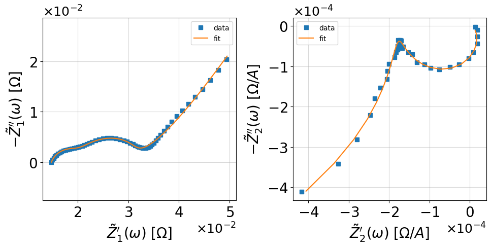

=========================================
Getting started with :code:`nleis.py`
=========================================

:code:`nleis.py` is designed to be a toolbox that can be seamlessly integrated into :code:`impedance.py` to facilitate NLEIS analysis and simultaneous analysis of EIS and 2nd-NLEIS. nleis.py also supports building nonlinear equivalent circuit models. Due to the nonlinear nature, the smallest building block is the nonlinear Randles circuit in nleis.py, while a single resistor and capacitor are supported in impedance.py. In short, nleis.py requires a wrapper function for the pair of linear and nonlinear responses.

.. hint::
  If you get stuck or believe you have found a bug, please feel free to open an
  `issue on GitHub <https://github.com/yuefan98/nleis.py>`_.

Step 1: Installation
====================

If you are not familiar with :code:`impedance.py`, please first read `their documentation <https://impedancepy.readthedocs.io/en/latest/getting-started.html>`_ before exploring this toolbox. This toolbox is designed to be fully integrated into the :code:`impedance.py` in the future. If you are only interested in :code:`nleis.py`, please skip this part and follow the pip install instruction for :code:`nleis.py`.
If you would like to use the impedance.py integrated version of nleis.py (which will be integrated soon), please first clone it from the GitHub repo using the following command, 

.. code-block:: bash

    !git clone https://github.com/yuefan98/nleis.py.git

Then, create a virtual environment using the :code:`environment.yml` file 

.. code-block:: bash

    conda env create -f environment.yml

After conda creates this environment, we need to activate it before we can
install anything into it by using:

.. code-block:: bash

   conda activate nleis

We've now activated our conda environment and are ready to use the :code:`nleis.py` integrated version of :code:`impedance.py`.

.. important::
  A standalone version of :code:`nleis.py` is available now. If you are only
  interested in the nonlinear equivalent circuit fitting feature, you can
  also directly install it with :code:`pip install`.

.. code-block:: bash
    
    pip install nleis

Lastly, the following example is developed with :code:`impedance.py` integrated version of :code:`nleis.py`. But the standalone :code:`nleis.py` can be called without calling :code:`impedance.py`. Besides this, all features are the same now for standalone :code:`nleis.py` and integrated :code:`nleis.py`. In the future, :code:`nleis.py` will likely be updated more frequently than the :code:`impedance.py` integrated version of :code:`nleis.py` to provide more developing features. 

Open Jupyter Lab
----------------

Next, we will launch an instance of Jupyter Lab:

.. code-block:: bash

  jupyter lab

which should open a new tab in your browser.

Step 2: Import your data
========================

To begin, we need to first load data from our 2nd-NLEIS manuscripts. The peer-reviewed paper for `Part I <https://iopscience.iop.org/article/10.1149/1945-7111/ad15ca>`_ and `II <https://iopscience.iop.org/article/10.1149/1945-7111/ad2596>`_ can be found from in Journal of Electrochemical Society.

Since there isn't a standard for data acquisition and preparation, the :code:`nleis.py` only provides a simple :code:`data_processing` to help users truncate their data. You will need to obtain your own frequencies, Z1, and Z2 data in order to use this function. A better data loading and processing function is under development.   

.. code-block:: python

    ## Loading the essential data
    import numpy as np
    frequencies = np.loadtxt('https://raw.githubusercontent.com/yuefan98/2nd-NLEIS-manuscripts/main/NLEIS_toolbox/data/freq_30a.txt')
    Z1 = np.loadtxt('https://raw.githubusercontent.com/yuefan98/2nd-NLEIS-manuscripts/main/NLEIS_toolbox/data/Z1s_30a.txt').view(complex)[1]
    Z2 = np.loadtxt('https://raw.githubusercontent.com/yuefan98/2nd-NLEIS-manuscripts/main/NLEIS_toolbox/data/Z2s_30a.txt').view(complex)[1]

Step 3: Process your data
==========================

Here, we provide a simple data processing function to help you truncate your data.

.. code-block:: python

    ## from nleis.nleis_fitting import data_processing ## Import command for standalone nleis.py
    from impedance.models.nleis.nleis_fitting import data_processing ## Import command for integrated nleis.py
    
    f,Z1,Z2,f2_trunc,Z2_trunc = data_processing(frequencies,Z1,Z2)

Step 3: Define your model
==========================

Unlike :code:`impedance.py`, the smallest building block is a nonlinear Randles circuit. Please refer to :doc:`examples/nleis_example` on how to define a nonlinear equivalent circuit model. In short, if you are familiar with linear ECM, you can easily create a nonlinear ECM by adding an `n` to the end of each linear element that can generate nonlinearity. See the following example.

.. code-block:: python

    ## from nleis import EISandNLEIS ##Import command for integrated nleis.py
    from impedance.models.nleis import EISandNLEIS ##Import command for integrated nleis.py
    
    circ_str_1 = 'L0-R0-TDS0-TDS1'
    circ_str_2 = 'd(TDSn0,TDSn1)'
    
    initial_guess = [1e-7,1e-3 # L0,RO
                       ,5e-3,1e-3,10,1e-2,100,10,0.1 ## TDS0 + additioal nonlinear parameters
                       ,1e-3,1e-3,1e-3,1e-2,1000,0,0 ## TDS1 + additioal nonlinear parameters
                       ]

Step 4: Fit to data 
==========================

You then need to fit initialize your :code:`EISandNLEIS` class for simultaneous analysis of EIS and 2nd-NLEIS.

.. code-block:: python

    circuit = EISandNLEIS(circ_str_1,circ_str_2,initial_guess=initial_guess)
    circuit.fit(f,Z1,Z2, opt='max');

Step 5: Visualize and print the results
========================================

.. code-block:: python

    circuit.plot(f_data=f, Z1_data =Z1, Z2_data= Z2, kind='nyquist')
    plt.tight_layout()
    plt.show()
    
    print(circuit)

.. code-block:: python

    EIS Circuit string: L0-R0-TDS0-TDS1
    NLEIS Circuit string: d(TDSn0,TDSn1)
    Fit: True
    
    EIS Initial guesses:
         L0 = 1.00e-07 [H]
         R0 = 1.00e-03 [Ohm]
      TDS0_0 = 5.00e-03 [Ohms]
      TDS0_1 = 1.00e-03 [Ohms]
      TDS0_2 = 1.00e+01 [F]
      TDS0_3 = 1.00e-02 [Ohms]
      TDS0_4 = 1.00e+02 [s]
      TDS1_0 = 1.00e-03 [Ohms]
      TDS1_1 = 1.00e-03 [Ohms]
      TDS1_2 = 1.00e-03 [F]
      TDS1_3 = 1.00e-02 [Ohms]
      TDS1_4 = 1.00e+03 [s]
    
    NLEIS Initial guesses:
      TDSn0_0 = 5.00e-03 [Ohms]
      TDSn0_1 = 1.00e-03 [Ohms]
      TDSn0_2 = 1.00e+01 [F]
      TDSn0_3 = 1.00e-02 [Ohms]
      TDSn0_4 = 1.00e+02 [s]
      TDSn0_5 = 1.00e+01 [1/V]
      TDSn0_6 = 1.00e-01 []
      TDSn1_0 = 1.00e-03 [Ohms]
      TDSn1_1 = 1.00e-03 [Ohms]
      TDSn1_2 = 1.00e-03 [F]
      TDSn1_3 = 1.00e-02 [Ohms]
      TDSn1_4 = 1.00e+03 [s]
      TDSn1_5 = 0.00e+00 [1/V]
      TDSn1_6 = 0.00e+00 []
    
    EIS Fit parameters:
         L0 = 9.81e-08  (+/- 1.96e-08) [H]
         R0 = 1.35e-02  (+/- 2.29e-04) [Ohm]
      TDS0_0 = 2.52e-02  (+/- 1.67e-03) [Ohms]
      TDS0_1 = 5.06e-03  (+/- 2.98e-04) [Ohms]
      TDS0_2 = 8.82e+00  (+/- 7.90e-01) [F]
      TDS0_3 = 8.81e-05  (+/- 8.19e-04) [Ohms]
      TDS0_4 = 3.60e+00  (+/- 3.34e+01) [s]
      TDS1_0 = 2.09e-02  (+/- 1.21e-03) [Ohms]
      TDS1_1 = 1.14e-03  (+/- 1.31e-04) [Ohms]
      TDS1_2 = 8.14e-01  (+/- 1.46e-01) [F]
      TDS1_3 = 1.71e+02  (+/- 2.42e+00) [Ohms]
      TDS1_4 = 2.78e+09  (+/- 7.44e-08) [s]
    
    NLEIS Fit parameters:
      TDSn0_0 = 2.52e-02  (+/- 1.67e-03) [Ohms]
      TDSn0_1 = 5.06e-03  (+/- 2.98e-04) [Ohms]
      TDSn0_2 = 8.82e+00  (+/- 7.90e-01) [F]
      TDSn0_3 = 8.81e-05  (+/- 8.19e-04) [Ohms]
      TDSn0_4 = 3.60e+00  (+/- 3.34e+01) [s]
      TDSn0_5 = 1.23e+01  (+/- 1.44e+00) [1/V]
      TDSn0_6 = 8.75e-02  (+/- 5.47e-03) []
      TDSn1_0 = 2.09e-02  (+/- 1.21e-03) [Ohms]
      TDSn1_1 = 1.14e-03  (+/- 1.31e-04) [Ohms]
      TDSn1_2 = 8.14e-01  (+/- 1.46e-01) [F]
      TDSn1_3 = 1.71e+02  (+/- 2.42e+00) [Ohms]
      TDSn1_4 = 2.78e+09  (+/- 7.44e-08) [s]
      TDSn1_5 = 1.02e+00  (+/- 7.02e-02) [1/V]
      TDSn1_6 = 6.39e-03  (+/- 5.77e-03) []

.. important::
  🎉 Congratulations! You're now up and running with impedance.py 🎉 For those who are already acquainted with :code:`impedance.py`, I hope you'll discover the similarities with :code:`nleis.py` and appreciate how closely aligned they are at this point.

.. note:: 

   In `nleis.py`, the linear and nonlinear circuit elements are defined in pairs. The nonlinear element can be distinguished by an additional `n` after the linear circuit element. For example, the currently supported linear and nonlinear element pairs are shown as the following:

   - High solid conductivity porous electrode (charge transfer only): **`[TPO,TPOn]`**
   - High solid conductivity porous electrode with planar diffusion: **`[TDP,TDPn]`**
   - High solid conductivity porous electrode with spherical diffusion: **`[TDS,TDSn]`**
   - High solid conductivity porous electrode with cylindrical diffusion: **`[TDC,TDCn]`**
   - Nonlinear Randles circuit with planar diffusion: **`[RCO,RCOn]`**
   - Nonlinear Randles circuit with cylindrical diffusion: **`[RCD,RCDn]`**
   - Nonlinear Randles circuit with spherical diffusion: **`[RCS,RCSn]`**
   - Nonlinear Transmission Line model with two RC branches (charge transfer only): **`[TLM,TLMn]`**
   - Nonlinear Transmission Line model with two RC branches, and spherical diffusion on one RC: **`[TLMS,TLMSn]`**

There are also under development versions of current distribution functions for linear and nonlinear TLMs. A detailed description will be included in the future. 

