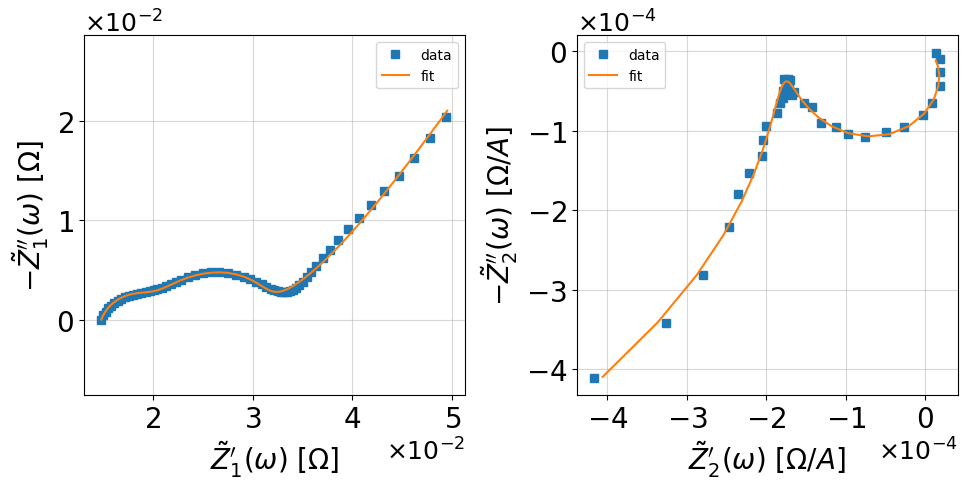

Getting Started
===============

:code:`nleis.py` extends :code:`impedance.py` with nonlinear equivalent circuit models for NLEIS analysis and simultaneous analysis of EIS and 2nd-NLEIS data. 
Due to the nonlinear nature, the smallest building block is the nonlinear Randles circuit in :code:`nleis.py`, while a single resistor and capacitor are supported in :code:`impedance.py`.
Linear and nonlinear responses are therefore defined as paired circuit elements.

.. hint::
  If you get stuck or believe you have found a bug, please feel free to open an
  `issue on GitHub <https://github.com/yuefan98/nleis.py>`_.

Workflow steps
--------------

This guide follows a complete first analysis workflow:

1. :ref:`Install nleis.py <getting-started-installation>`.
2. :ref:`Load EIS and 2nd-NLEIS example data <getting-started-import-data>`.
3. :ref:`Preprocess the harmonic data <getting-started-process-data>`.
4. :ref:`Define paired EIS and NLEIS model strings <getting-started-define-model>`.
5. :ref:`Fit the paired model to data <getting-started-fit-data>`.
6. :ref:`Visualize and inspect the fitted result <getting-started-visualize-results>`.

.. _getting-started-installation:

Step 1: Installation
--------------------

If you are not familiar with :code:`impedance.py`, first read the `impedance.py documentation <https://impedancepy.readthedocs.io/en/latest/getting-started.html>`_. Then follow these instructions to set up an environment and install :code:`nleis.py` from PyPI.

The recommended setup uses the :code:`environment.yml` file from the GitHub repository to create a new conda environment.

.. code-block:: bash

    conda env create -f environment.yml

After conda creates the environment, activate it before installing the package:

.. code-block:: bash

   conda activate nleis

We've now activated our conda environment and are ready to install :code:`nleis.py`.

.. code-block:: bash
    
    pip install nleis

We’ve now got everything in place to start analyzing our 2nd-NLEIS data!

Open Jupyter Lab
~~~~~~~~~~~~~~~~

Next, we will launch an instance of Jupyter Lab:

.. code-block:: bash

  jupyter lab

which should open a new tab in your browser.

.. _getting-started-import-data:

Step 2: Import your data
------------------------

To begin, load data from the 2nd-NLEIS example manuscripts. The peer-reviewed papers for `Part I <https://iopscience.iop.org/article/10.1149/1945-7111/ad15ca>`_ and `Part II <https://iopscience.iop.org/article/10.1149/1945-7111/ad2596>`_ are available as open-access articles in the Journal of The Electrochemical Society.

Because acquisition and processing standards for second-harmonic NLEIS data are still developing, :code:`nleis.py` provides :code:`data_truncation` for simple frequency-domain preprocessing. The data-processing module also includes data loaders for EIS instruments that export frequency-domain harmonic data or time-domain data suitable for signal processing.

.. code-block:: python

    ## Loading the essential data
    import numpy as np
    frequencies = np.loadtxt('https://raw.githubusercontent.com/yuefan98/2nd-NLEIS-manuscripts/main/NLEIS_toolbox/data/freq_30a.txt')
    Z1 = np.loadtxt('https://raw.githubusercontent.com/yuefan98/2nd-NLEIS-manuscripts/main/NLEIS_toolbox/data/Z1s_30a.txt').view(complex)[1]
    Z2 = np.loadtxt('https://raw.githubusercontent.com/yuefan98/2nd-NLEIS-manuscripts/main/NLEIS_toolbox/data/Z2s_30a.txt').view(complex)[1]

.. _getting-started-process-data:

Step 3: Process your data
-------------------------

Here, we provide :code:`data_truncation` to remove high-frequency inductance effects and prepare the 2nd-NLEIS frequency range (default max_f = 10).

.. code-block:: python

    from nleis.data_processing import data_truncation

    f, Z1, Z2, f2_trunc, Z2_trunc = data_truncation(frequencies, Z1, Z2)

.. _getting-started-define-model:

Step 4: Define your model
-------------------------

Unlike :code:`impedance.py`, the smallest nonlinear building block is a nonlinear Randles circuit. See :doc:`../examples/nleis_example` for a longer model-building example. If you are familiar with linear equivalent circuit models (ECMs), you can create a paired nonlinear ECM by adding :code:`n` to the end of each linear element that can generate nonlinearity.

The following example presents a two-electrode cell model with porous electrodes composed of spherical particles for both the positive and negative electrodes. Methodological details are provided in the peer-reviewed `Part I manuscript <https://iopscience.iop.org/article/10.1149/1945-7111/ad15ca>`_.
For EIS of a two-electrode cell, the individual impedances of each electrode are added in series with an ohmic resistance and an inductance (:code:`EIS_circuit`). The 2nd-NLEIS response is the difference between the individual electrode responses, with the negative electrode 2nd-NLEIS signal subtracted from the positive electrode signal (:code:`NLEIS_circuit`).

.. code-block:: python

    from nleis import EISandNLEIS
    
    EIS_circuit = 'L0-R0-TDS0-TDS1'
    NLEIS_circuit = 'd(TDSn0,TDSn1)'
    
    initial_guess = [
        1e-7, 1e-3,  # L0, R0
        5e-3, 1e-3, 10, 1e-2, 100, 10, 0.1,  # TDS0 + nonlinear parameters
        1e-3, 1e-3, 1e-3, 1e-2, 1000, 0, 0,  # TDS1 + nonlinear parameters
    ]

.. _getting-started-fit-data:

Step 5: Fit to data
-------------------

We then need to initialize :code:`EISandNLEIS` class for simultaneous analysis of EIS and 2nd-NLEIS data.

.. code-block:: python

    circuit = EISandNLEIS(EIS_circuit, NLEIS_circuit, initial_guess=initial_guess)
    circuit.fit(f, Z1, Z2, opt='max')

.. _getting-started-visualize-results:

Step 6: Visualize and print the results
---------------------------------------

.. code-block:: python
  
    import matplotlib.pyplot as plt
    circuit.plot(f_data=f, Z1_data=Z1, Z2_data=Z2, kind='nyquist')
    plt.tight_layout()
    plt.show()
    
    print(circuit)

.. code-block:: python

    EIS Circuit string: L0-R0-TDS0-TDS1
    NLEIS Circuit string: d(TDSn0,TDSn1)
    Fit: True
    
    EIS Initial guesses:
         L0 = 1.00e-07 [H]
         R0 = 1.00e-03 [Ohm]
      TDS0_0 = 5.00e-03 [Ohms]
      TDS0_1 = 1.00e-03 [Ohms]
      TDS0_2 = 1.00e+01 [F]
      TDS0_3 = 1.00e-02 [Ohms]
      TDS0_4 = 1.00e+02 [s]
      TDS1_0 = 1.00e-03 [Ohms]
      TDS1_1 = 1.00e-03 [Ohms]
      TDS1_2 = 1.00e-03 [F]
      TDS1_3 = 1.00e-02 [Ohms]
      TDS1_4 = 1.00e+03 [s]
    
    NLEIS Initial guesses:
      TDSn0_0 = 5.00e-03 [Ohms]
      TDSn0_1 = 1.00e-03 [Ohms]
      TDSn0_2 = 1.00e+01 [F]
      TDSn0_3 = 1.00e-02 [Ohms]
      TDSn0_4 = 1.00e+02 [s]
      TDSn0_5 = 1.00e+01 [1/V]
      TDSn0_6 = 1.00e-01 []
      TDSn1_0 = 1.00e-03 [Ohms]
      TDSn1_1 = 1.00e-03 [Ohms]
      TDSn1_2 = 1.00e-03 [F]
      TDSn1_3 = 1.00e-02 [Ohms]
      TDSn1_4 = 1.00e+03 [s]
      TDSn1_5 = 0.00e+00 [1/V]
      TDSn1_6 = 0.00e+00 []
    
    EIS Fit parameters:
         L0 = 9.81e-08  (+/- 1.96e-08) [H]
         R0 = 1.35e-02  (+/- 2.29e-04) [Ohm]
      TDS0_0 = 2.52e-02  (+/- 1.67e-03) [Ohms]
      TDS0_1 = 5.06e-03  (+/- 2.98e-04) [Ohms]
      TDS0_2 = 8.82e+00  (+/- 7.90e-01) [F]
      TDS0_3 = 8.81e-05  (+/- 8.19e-04) [Ohms]
      TDS0_4 = 3.60e+00  (+/- 3.34e+01) [s]
      TDS1_0 = 2.09e-02  (+/- 1.21e-03) [Ohms]
      TDS1_1 = 1.14e-03  (+/- 1.31e-04) [Ohms]
      TDS1_2 = 8.14e-01  (+/- 1.46e-01) [F]
      TDS1_3 = 1.71e+02  (+/- 2.42e+00) [Ohms]
      TDS1_4 = 2.78e+09  (+/- 7.44e-08) [s]
    
    NLEIS Fit parameters:
      TDSn0_0 = 2.52e-02  (+/- 1.67e-03) [Ohms]
      TDSn0_1 = 5.06e-03  (+/- 2.98e-04) [Ohms]
      TDSn0_2 = 8.82e+00  (+/- 7.90e-01) [F]
      TDSn0_3 = 8.81e-05  (+/- 8.19e-04) [Ohms]
      TDSn0_4 = 3.60e+00  (+/- 3.34e+01) [s]
      TDSn0_5 = 1.23e+01  (+/- 1.44e+00) [1/V]
      TDSn0_6 = 8.75e-02  (+/- 5.47e-03) []
      TDSn1_0 = 2.09e-02  (+/- 1.21e-03) [Ohms]
      TDSn1_1 = 1.14e-03  (+/- 1.31e-04) [Ohms]
      TDSn1_2 = 8.14e-01  (+/- 1.46e-01) [F]
      TDSn1_3 = 1.71e+02  (+/- 2.42e+00) [Ohms]
      TDSn1_4 = 2.78e+09  (+/- 7.44e-08) [s]
      TDSn1_5 = 1.02e+00  (+/- 7.02e-02) [1/V]
      TDSn1_6 = 6.39e-03  (+/- 5.77e-03) []

.. important::
  🎉 Congratulations! You're now up and running with :code:`nleis.py` 🎉 For those who are already acquainted with :code:`impedance.py`, we expect you will quickly discover the similarities with :code:`nleis.py` and appreciate their close alignment at this point.

.. note:: 

   In :code:`nleis.py`, linear and nonlinear circuit elements are defined in pairs. The nonlinear element is identified by an additional :code:`n` after the linear circuit element. The currently supported linear and nonlinear element pairs include:

   - Nonlinear Randles circuit (charge transfer only): **[RC,RCn]**
   - Nonlinear Randles circuit with planar diffusion in a bounded thin film electrode: **[RCD,RCDn]**
   - Nonlinear Randles circuit with diffusion into spherical electrode particles (effectively a single particle model): **[RCS,RCSn]**
   - High conductivity porous electrode permeated by a low ionic conductivity electrolyte undergoing charge transfer at the interface: **[TP,TPn]**
   - High conductivity porous electrode permeated by a low ionic conductivity electrolyte undergoing charge transfer and diffusion into platelet-like electrode particles: **[TDP,TDPn]**
   - High conductivity porous electrode permeated by a low ionic conductivity electrolyte undergoing charge transfer and diffusion into spherical electrode particles: **[TDS,TDSn]**
   - High conductivity porous electrode permeated by a low ionic conductivity electrolyte undergoing charge transfer and diffusion into cylindrical electrode particles: **[TDC,TDCn]**
  
   Nonlinear transmission line models (TLMs) and their corresponding current distribution functions are also available for advanced workflows:

   - Nonlinear transmission line model for a high conductivity porous electrode permeated by a low ionic conductivity electrolyte undergoing interfacial charge transfer through two RC circuits in series, representing an ultrathin surface film covering the bulk solid electrode: **[TLM,TLMn]**
   - Nonlinear transmission line model for a high conductivity porous electrode permeated by a low ionic conductivity electrolyte undergoing interfacial charge transfer through two RC circuits in series, with the first RC representing an ultrathin surface film covering bulk spherical particles with both charge transfer and diffusion impedances: **[TLMS,TLMSn]**
   - Nonlinear transmission line model for a high conductivity porous electrode permeated by a low ionic conductivity electrolyte undergoing interfacial charge transfer through two RC circuits in series, with the first RC representing an ultrathin surface film covering bulk platelet-like particles with both charge transfer and diffusion impedances: **[TLMD,TLMDn]**
